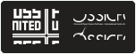

  

## About Us

FOSS Club GEC Palakkad is a non-profit foundation that aims at promoting and strengthening the Free and Open Source Software (FOSS) ecosystem among GEC-ians. We believe in the power of open-source software to transform technology education and foster innovation within our college community.

## Our Mission

- Promote FOSS philosophy and culture among students and faculty
- Conduct workshops, seminars, and hands-on sessions on open-source technologies
- Encourage students to contribute to open-source projects
- Build a community of FOSS enthusiasts and developers
- Collaborate with other FOSS communities and organizations

## Activities

- **Workshops**: Regular hands-on sessions on various open-source technologies
- **Hackathons**: Coding competitions focusing on open-source solutions
- **Mentorship**: Guidance for students interested in contributing to open-source projects
- **Tech Talks**: Inviting industry experts and FOSS advocates to share their knowledge
- **Project Collaborations**: Working together on open-source projects

## Join Us

We welcome all students, faculty members, and FOSS enthusiasts to join our community. Whether you're a beginner or an experienced developer, there's always something to learn and contribute.

- **Social Media**: https://www.instagram.com/fossgecp/

---

  

We proudly collaborate with:
- **FOSS United**: A foundation working towards promoting Free and Open Source Software in India
- **ICFOSS (International Centre for Free and Open Source Software)**: A government organization fostering FOSS initiatives

---

  Made with ❤️ by FOSS Club GEC Palakkad

